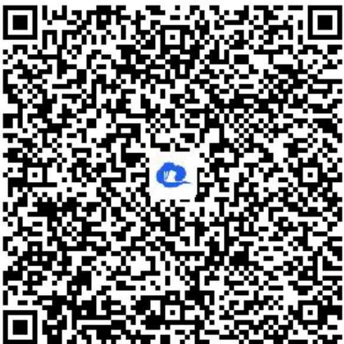

> [!faq]- 《基本不等式（1）》答案与解析
>
> > [!success]- **【答案】** (1)
>
> > [!note]- **【解析】**
> > (2)【问答题】见解析视频
> >
> > ##
> > 【提示】
> >
> > (1)【问答题】解析视频请查看最后一题。
> >
> > 【更多习题信息】
> >
> > 难易度：适中
> >
> > 知识点：利用基本不等式证明不等式（无附加条件）
> >
> > 【智慧中小学APP扫码查看完整解析】
> >
> > 
