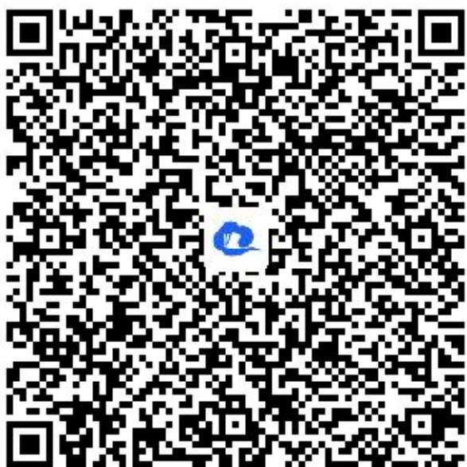

> [!faq]- 《一元二次函数、方程和不等式（1）》答案与解析
>
> > [!success]- **【答案】** $\frac{1}{2}\leq m\leq\frac{1+\sqrt{2}}{2}$
>
> > [!note]- **【解析】**
> > 【更多习题信息】
> >
> > 难易度：适中
> >
> > 知识点：含绝对值的一元二次函数的最值
> >
> > 【智慧中小学APP扫码查看完整解析】
> >
> > 
