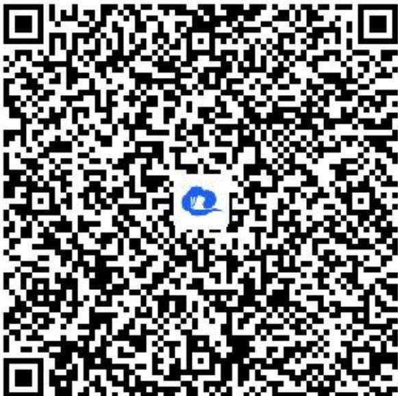

> [!faq]- 《一元二次函数、方程和不等式（2）》答案与解析
>
> > [!success]- **【答案】** $\left(-\frac{\sqrt{2}}{2},0\right)$
>
> > [!note]- **【解析】**
> > 【更多习题信息】
> >
> > 难易度：简单
> >
> > 知识点：一元二次不等式的恒成立与可成立问题 变换主元法
> >
> > 【智慧中小学APP扫码查看完整解析】
> >
> > 
