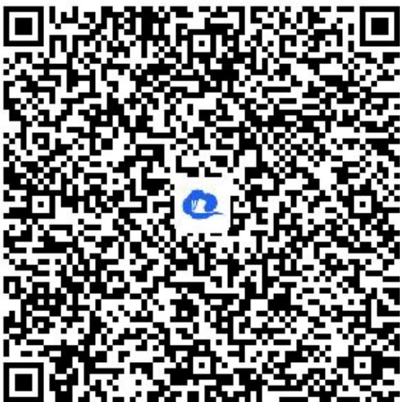

> [!faq]- 《一元二次函数、方程和不等式（2）》答案与解析
>
> > [!success]- **【答案】** $\left(\frac{25}{9}, \frac{49}{16}\right]$
>
> > [!note]- **【解析】**
> > 【更多习题信息】
> >
> > 难易度：偏难
> >
> > 知识点：一元二次不等式的整数解问题
> >
> > 【智慧中小学APP扫码查看完整解析】
> >
> > 
