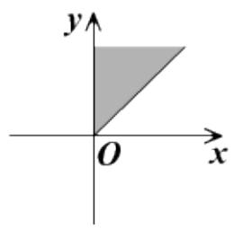
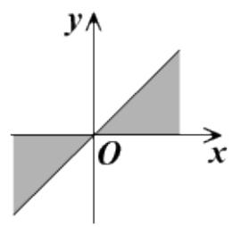
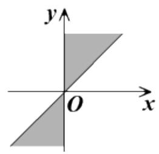
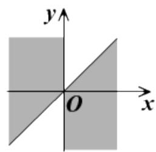

<!-- question-source:start -->
4.【填空题】集合 $\{\alpha|k\cdot180^{\circ}+45^{\circ}\leq\alpha\leq k\cdot180^{\circ}+90^{\circ},\quad k\in Z\}$

中，角所表示的取值范围（阴影部分）正确的是 \_\_\_\_ （填序号）.

  
③

  
④
<!-- question-source:end -->

![[高中/课堂同步/智慧中小学/必修第一册/第五章 三角函数/5.1 任意角和弧度制/任意角/二_填空题/习题/answers/Q00051394A1.md]]
