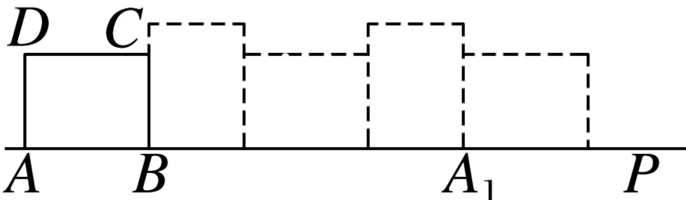

<!-- question-source:start -->
3.【填空题】在矩形ABCD中，AB=4，AD=3，将该矩形按照如图所示位置放置在直线AP上，然后不滑动的转动，当它转动一周时 $(A\rightarrow A_{1})$

叫做一次操作，则经过5次这样的操作，顶点A经过的路线长等于\_\_\_\_。

<!-- question-source:end -->

![[高中/课堂同步/智慧中小学/必修第一册/第五章 三角函数/5.1 任意角和弧度制/弧度制/二_填空题/习题/answers/Q00051406A1.md]]
