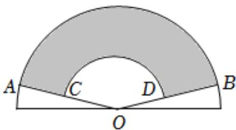

<!-- question-source:start -->
4.【填空题】中国折扇有着深厚的文化底蕴。如图所示，在半径为20cm的半圆O中作出两个扇形OAB和OCD，用扇环形ABDC（图中阴影部分）制作折扇的扇面。记扇环形ABDC的面积为 $S_{1}$ ，扇形OAB的面积为 $S_{2}$ ，当 $\frac{S_{1}}{S_{2}}=\frac{\sqrt{5}-1}{2}$ 时，扇形的形状较为美观，则此时扇形OCD的半径为\_\_\_\_。

<!-- question-source:end -->

![[高中/课堂同步/智慧中小学/必修第一册/第五章 三角函数/5.1 任意角和弧度制/弧度制/二_填空题/习题/answers/Q00051407A1.md]]
