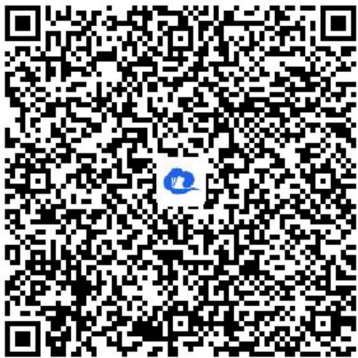

> [!faq]- 《同角三角函数的基本关系》答案与解析
>
> > [!success]- **【答案】** 证明：
>
> > [!note]- **【解析】**
> > $$
> > \text {左边} = 2 - 2 \sin \alpha + 2 \cos \alpha - 2 \sin \alpha \cos \alpha = 1 + \sin^ {2} \alpha + \cos^ {2} \alpha - 2 \sin \alpha \cos \alpha + 2 (\cos \alpha - \sin \alpha) = 1 + 2
> > $$
> >
> > $$
> > (c o s \alpha - s i n \alpha) + (c o s \alpha - s i n \alpha) ^ {2} = (1 - s i n \alpha + c o s \alpha) ^ {2}
> > $$
> >
> > = 右边
> >
> > 【更多习题信息】
> >
> > 难易度：适中
> >
> > 知识点：同角三角函数的基本关系、简单的三角恒等式的证明
> >
> > 【智慧中小学APP扫码查看完整解析】
> >
> > 
