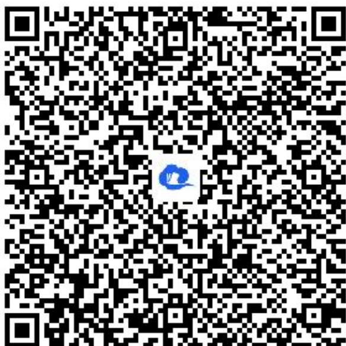

> [!faq]- 《同角三角函数的基本关系》答案与解析
>
> > [!success]- **【答案】** (1)
>
> > [!note]- **【解析】**
> > (2)【问答题】 $\tan\alpha\sqrt{\frac{1}{\sin^{2}\alpha}-1}=\tan\alpha\sqrt{\frac{1-\sin^{2}\alpha}{\sin^{2}\alpha}}=\tan\alpha\sqrt{\frac{\cos^{2}\alpha}{\sin^{2}\alpha}}=\frac{\sin\alpha}{\cos\alpha}\cdot\frac{-\cos\alpha}{\sin\alpha}=-1$
> >
> > 【提示】
> >
> > (1)【问答题】解析视频请查看最后一题。
> >
> > 【更多习题信息】
> >
> > 难易度：适中
> >
> > 知识点：同角三角函数的基本关系、简单的三角式子的化简、求值【智慧中小学APP扫码查看完整解析】
> >
> > 
