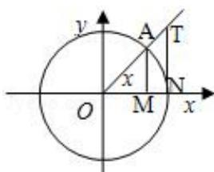

> [!faq]- 《同角三角函数的基本关系》答案与解析
>
> > [!success]- **【答案】** (1)
>
> > [!note]- **【解析】**
> > （1）在单位圆中，有 $S_{\Delta OAN} < S_{扇形OAN} < S_{\Delta ONT}, \quad \therefore \frac{1}{2}ON \cdot MA < \frac{1}{2}ON \cdot x < \frac{1}{2}ON \cdot NT,$ 即 MA < x < NT，又 $\sin x = MA, \cos x = OM, \tan x = NT, \quad \therefore \sin x < x < \tan x;$
> >
> > (2)【问答题】
> > （2） $\because \frac{1}{2}, \frac{2}{3}, \frac{3}{4}, \frac{2010}{2011}$ 均为小于 $\frac{\pi}{2}$ 的正数， $\sin \frac{1}{2} < \frac{1}{2}, \sin \frac{2}{3} < \frac{2}{3}, \sin \frac{3}{4} < \frac{3}{4}, \sin \frac{2010}{2011} < \frac{2010}{2011}$ ，
> >
> > 将以上2010道式相乘得 $\sin\frac{1}{2}\cdot\sin\frac{2}{3}\cdot\sin\frac{3}{4}\cdot\cdots\cdot\sin\frac{2010}{2011}<\frac{1}{2}\cdot\frac{2}{3}\cdot\frac{3}{4}\cdots\frac{2010}{2011}=\frac{1}{2011}<\frac{1}{2010},$
> >
> > 即 $\sin\frac{1}{2}\cdot\sin\frac{2}{3}\cdot\sin\frac{3}{4}\cdot\cdots\cdot\sin\frac{2010}{2011}<\frac{1}{2010}.$
> >
> > 
> >
> > 【提示】
> >
> > (1)【问答题】解析视频请查看最后一题。
> >
> > 【更多习题信息】
> >
> > 难易度：适中
> >
> > 知识点：同角三角函数的基本关系、简单的三角恒等式的证明
> >
> > 【智慧中小学APP扫码查看完整解析】
> >
> > 
