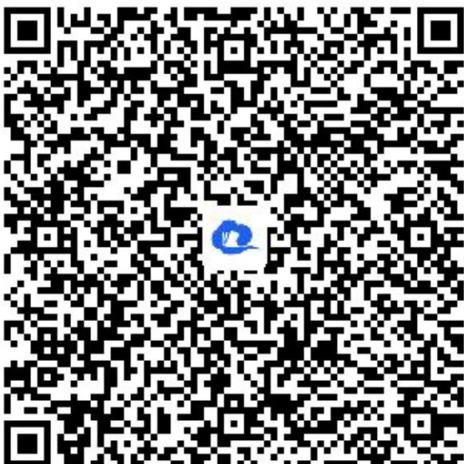

> [!faq]- 《同角三角函数的基本关系应用》答案与解析
>
> > [!success]- **【答案】** $-\frac{2}{sin\theta}$
>
> > [!note]- **【解析】**
> > 【更多习题信息】
> >
> > 难易度：简单
> >
> > 知识点：同角三角函数的基本关系、简单的三角式子的化简、求值
> >
> > 【智慧中小学APP扫码查看完整解析】
> >
> > 
