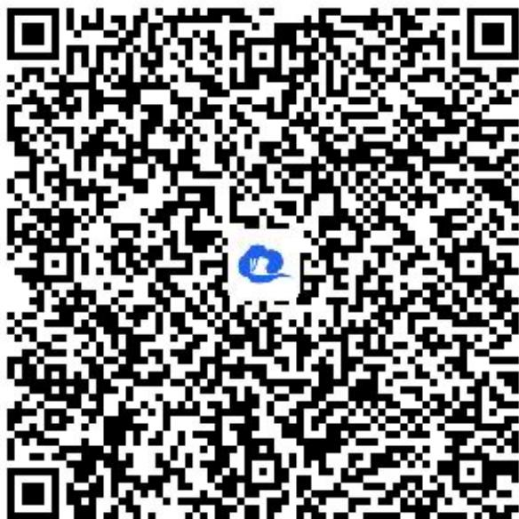

> [!faq]- 《诱导公式(1)》答案与解析
>
> > [!success]- **【答案】** (1)
>
> > [!note]- **【解析】**
> > (2)【问答题】若 $f(\frac{\pi}{3}-\alpha)=\frac{1}{3}$ ，则 $cos(\frac{\pi}{3}-\alpha)=\frac{1}{3}$ ,
> >
> > $$
> > \therefore \cos^ {2} (\frac {\pi}{6} + \alpha) = \cos^ {2} \left[ \frac {\pi}{2} - (\frac {\pi}{3} - \alpha) \right] = \sin^ {2} (\frac {\pi}{3} - \alpha) = 1 - \cos^ {2} (\frac {\pi}{3} - \alpha) = 1 - \frac {l}{9} = \frac {8}{9},
> > $$
> >
> > $$
> > c o s (\frac {2 \pi}{3} + \alpha) = c o s \left[ \pi - (\frac {\pi}{3} - \alpha) \right] = - c o s (\frac {\pi}{3} - \alpha) = - \frac {1}{3},
> > $$
> >
> > 则 $cos^2 (\frac{\pi}{6} +\alpha) + cos(\frac{2\pi}{3} +\alpha) = \frac{8}{9} -\frac{1}{3} = \frac{5}{9}.$
> >
> > 【提示】
> >
> > (1)【问答题】解析视频请查看最后一题。
> >
> > 【更多习题信息】
> >
> > 难易度：适中
> >
> > 知识点：诱导公式、诱导公式同名异名化简、诱导公式的综合应用【智慧中小学APP扫码查看完整解析】
> >
> > 
