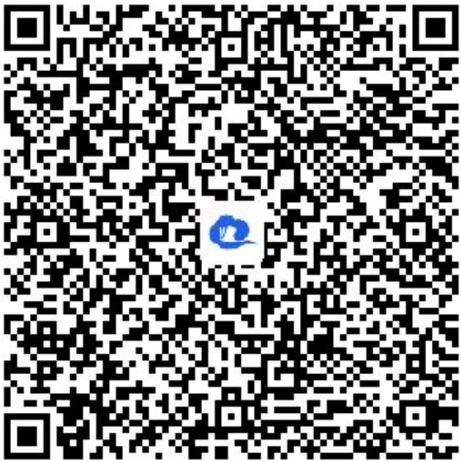

> [!faq]- 《诱导公式(2)》答案与解析
>
> > [!success]- **【答案】** (1)
>
> > [!note]- **【解析】**
> > $\therefore \sin \alpha = -\sqrt{1 - \cos^2\alpha} = -\sqrt{1 - \left(-\frac{4}{5}\right)^2} = -\frac{3}{5}, \quad \therefore \tan \alpha = \frac{\sin \alpha}{\cos \alpha} = \frac{3}{4};$
> >
> > (2)【问答题】 $\frac{2\sin(\pi - \alpha) + \sin(\frac{\pi}{2} - \alpha)}{\cos(2\pi - \alpha) + \cos(-\alpha)} = \frac{2\sin\alpha + \cos\alpha}{\cos\alpha + \cos\alpha} = \frac{2\sin\alpha + \cos\alpha}{2\cos\alpha} = \frac{2\tan\alpha + 1}{2} = \frac{2\times\frac{3}{4} + 1}{2} = \frac{5}{4}$
> >
> > (1)【问答题】解析视频请查看最后一题。
> >
> > 【更多习题信息】
> >
> > 难易度：适中
> >
> > 知识点：诱导公式、诱导公式同名异名化简、诱导公式的综合应用
> >
> > 【智慧中小学APP扫码查看完整解析】
> >
> > 
