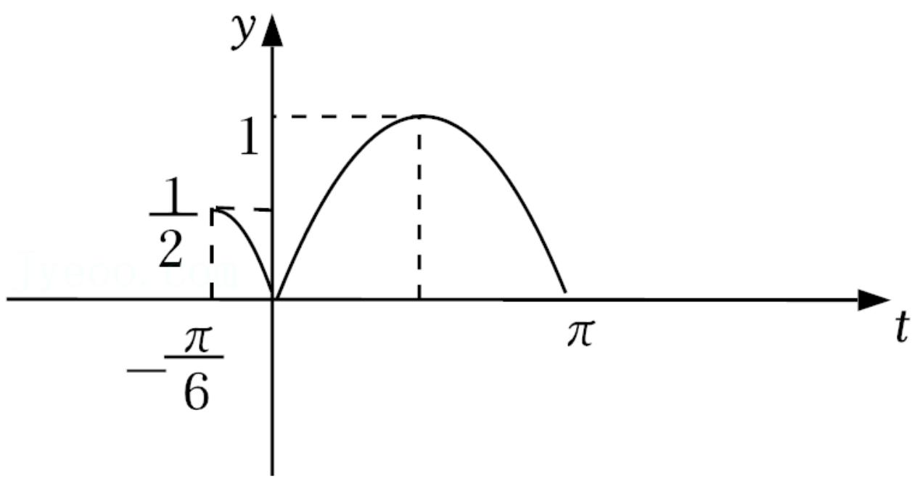

> [!faq]- 《余弦函数的图象》答案与解析
>
> > [!success]- **【答案】** (1)
>
> > [!note]- **【解析】**
> > $\sin2x + (\sin x - \cos x)(\sin x + \cos x) = \sin(2x - \frac{\pi}{6})$ 由 $2k\pi - \frac{\pi}{2} \leqslant 2x - \frac{\pi}{6} \leqslant 2k\pi + \frac{\pi}{2}, k \in Z$ ，解得 $k\pi - \frac{\pi}{6} \leqslant x \leqslant k\pi + \frac{\pi}{3}, k \in Z$ ，
> >
> > 所以 $f(x)$ 的单调增区间为 $[k\pi -\frac{\pi}{6}, k\pi +\frac{\pi}{3} ], k\in Z$
> >
> > (2)【问答题】因为 $x \in [0, \frac{7\pi}{12})$ ，所以设 $t = 2x - \frac{\pi}{6}$ ，则 $t \in [-\frac{\pi}{6}, \pi)$ ，
> >
> > 所以 $f(x) = \sin (2x - \frac{\pi}{6})\in [ - \frac{1}{2},1]$ ， $y = |sin t|$ 的图象如图，
> >
> > 要使 $y = |sint| - m$ 在 $[- \frac{\pi}{6}, \pi)$ 有两个零点，则 $\frac{1}{2} < m < 1$ ，故 $m$ 的取值范围是 $\left(\frac{1}{2}, 1\right)$ .
> >
> > 
> >
> > 【提示】
> >
> > (1)【问答题】解析视频请查看最后一题。
> >
> > 【更多习题信息】
> >
> > 难易度：适中
> >
> > 知识点：正、余弦函数的图象、正、余弦函数的性质
> >
> > 【智慧中小学APP扫码查看完整解析】
> >
> > 
