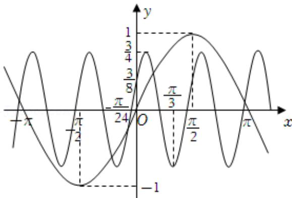

<!-- question-source:start -->
2.【单选题】在信息传递中多数是以波的形式进行传递，其中必然会存在干扰信号，形如 $y = A \sin (\omega x + \varphi) \left( A > 0, \omega > 0, |\varphi| < \frac{\pi}{2} \right)$ ，某种“信号净化器”可产生形如 $y = A_0 \sin (\omega_0 x + \varphi_0)$ 的波，只需要调整参数 $(A_0, \omega_0, \varphi_0)$

，就可以产生特定的波（与干扰波波峰相同，方向相反的波）来“对抗”干扰。现有波形信号的部分图象，想要通过“信号净化器”过滤得到标准的正弦波（标准正弦函数图象），应将波形净化器的参数分别调整为（）

A. $A_0 = \frac{3}{4}, \omega_0 = 4, \varphi_0 = \frac{\pi}{6}$ 
B. $A_0 = -\frac{3}{4}, \omega_0 = 4, \varphi_0 = \frac{\pi}{6}$ 
C. $A_0 = 1, \omega_0 = 1, \varphi_0 = 0$ 
D. $A_0 = -1, \omega_0 = 1, \varphi_0 = 0$
<!-- question-source:end -->

![[高中/课堂同步/智慧中小学/必修第一册/第五章 三角函数/5.4.3 正切函数的性质与图象/三角函数的图像与性质应用_1_/一_单选题/习题/answers/Q00051152A1.md]]
