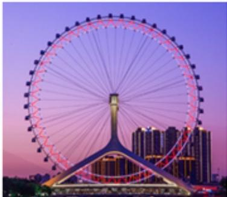

<!-- question-source:start -->
3.【单选题】如图，某摩天轮最高点距离地面高度为 $120 \mathrm{~m}$ ，转盘直径为 $110 \mathrm{~m}$ ，开启后按逆时针方向匀速旋转，旋转一周需要 $30 \mathrm{~min}$ 。游客在座舱转到距离地面最近的位置进舱，开始转动 $t \mathrm{~min}$ 后距离地面的高度为 $H \mathrm{~m}$ ，则在转动一周的过程中，高度 $H$ 关于时间 $t$ 的函数解析式是（）

A. $H = 55\cos \left(\frac{\pi}{15} t - \frac{\pi}{2}\right) + 65(0 \leq t \leq 30)$ 
B. $H = 55\sin \left(\frac{\pi}{15} t - \frac{\pi}{2}\right) + 65(0 \leq t \leq 30)$ 
C. $H = -55\cos \left(\frac{\pi}{10} t + \frac{\pi}{2}\right) + 65(0 \leq t \leq 30)$ 
D. $H = -55\sin \left(\frac{\pi}{10} t + \frac{\pi}{2}\right) + 65(0 \leq t \leq 30)$
<!-- question-source:end -->

![[高中/课堂同步/智慧中小学/必修第一册/第五章 三角函数/5.4.3 正切函数的性质与图象/三角函数的图像与性质应用_1_/一_单选题/习题/answers/Q00051153A1.md]]
