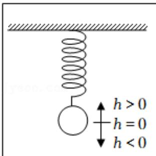

<!-- question-source:start -->
5.【单选题】如图，弹簧挂着一个小球作上下运动，小球在 $t$ 秒时相对于平衡位置的高度 $h$ （厘米）由如下关系式确定： $h = 2\sin \left(\frac{\pi}{6} t + \varphi\right)$ ， $t \in [0, +\infty)$ ， $\phi \in (-\pi, \pi)$ 。已知当 $t = 2$ 时，小球处于平衡位置，并开始向下移动，则小球在 $t = 0$ 秒时 $h$ 的值为（）

A. -2  
B. 2  
C. $-\sqrt{3}$ 
D. $\sqrt{3}$
<!-- question-source:end -->

![[高中/课堂同步/智慧中小学/必修第一册/第五章 三角函数/5.4.3 正切函数的性质与图象/三角函数的图像与性质应用_1_/一_单选题/习题/answers/Q00051155A1.md]]
