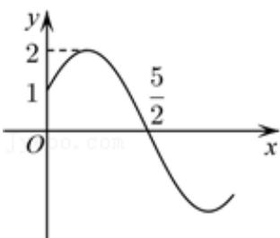

<!-- question-source:start -->
6.【单选题】已知函数 $f(x) = A \sin (\omega x + \varphi) \left( A > 0, \omega > 0, |\varphi| < \frac{\pi}{2} \right)$ 的图象如图所示，则下面描述不正确的是（）

A. $\omega = \frac{\pi}{3}$ 
B. $\varphi = \frac{\pi}{6}$ 
C. $f
(2) = 1$ 
D. $f
(3) = -\frac{1}{2}$
<!-- question-source:end -->

![[高中/课堂同步/智慧中小学/必修第一册/第五章 三角函数/5.4.3 正切函数的性质与图象/三角函数的图像与性质应用_1_/一_单选题/习题/answers/Q00051156A1.md]]
