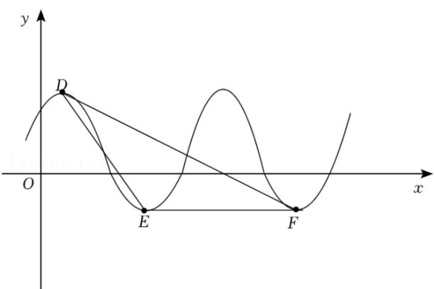

<!-- question-source:start -->
1.【单选题】已知某简谐振动的振动方程是 $f(x)=A\sin(\omega x+\varphi)+B(A>0,\omega>0)$

，该方程的部分图象如图．经测量，振幅为 $\sqrt{3}$

．图中的最高点D与最低点E，F为等腰三角形的顶点，则振动的频率是（）

A. 0.125Hz  
B. 0.25Hz  
C. 0.4Hz  
D. 0.5Hz
<!-- question-source:end -->

![[高中/课堂同步/智慧中小学/必修第一册/第五章 三角函数/5.4.3 正切函数的性质与图象/三角函数的图像与性质应用_1_/一_单选题/习题/answers/Q00051474A1.md]]
