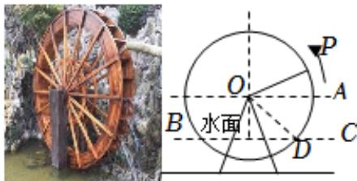

<!-- question-source:start -->
7.【填空题】筒车亦称为“水转筒车”，一种以流水为动力，取水灌田的工具，筒车发明于隋而盛于唐，距今已有1000多年的历史．如图，假设在水流量稳定的情况下，一个半径为3米的筒车按逆时针方向做每6分钟转一圈的匀速圆周运动，筒车的轴心O距离水面BC的高度为1.5米，设筒车上的某个盛水筒P的初始位置为点D（水面与筒车右侧的交点），从此处开始计时，t分钟时，该盛水筒距水面距离为 $H=f(t)=A\sin(\omega t+\phi)+b(A>0,\omega>0,\left|\phi\right|<\frac{\pi}{2},t\geqslant0)$ ，则 $H=f(t)=$ \_\_\_\_.

<!-- question-source:end -->

![[高中/课堂同步/智慧中小学/必修第一册/第五章 三角函数/5.4.3 正切函数的性质与图象/三角函数的图像与性质应用_1_/二_填空题/习题/answers/Q00051475A1.md]]
