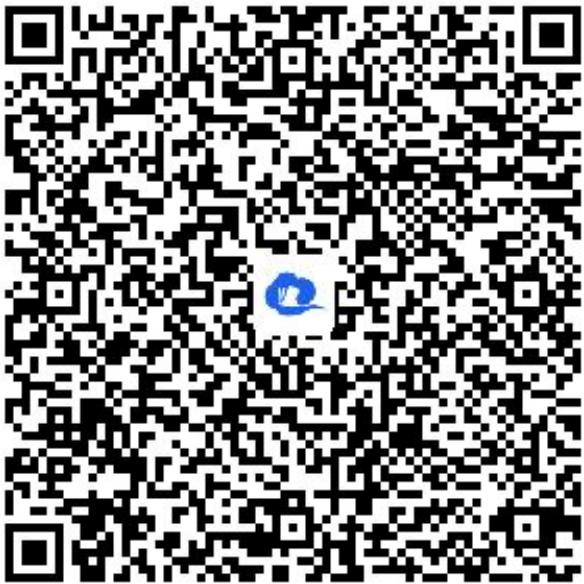

> [!faq]- 《三角函数的图像与性质应用（1）》答案与解析
>
> > [!success]- **【答案】** $3\sin\left(\frac{\pi}{3}t-\frac{\pi}{6}\right)+1.5(t\geq0)$ .
>
> > [!note]- **【解析】**
> > 【更多习题信息】
> >
> > 难易度：偏难
> >
> > 知识点：三角函数的性质应用、三角函数的性质综合运用
> >
> > 【智慧中小学APP扫码查看完整解析】
> >
> > 
