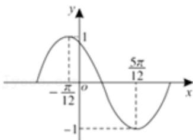

<!-- question-source:start -->
4.【单选题】函数 $f(x)=\sin(\omega x+\varphi)(\omega>0,\quad0<\varphi<\pi)$

在一个周期内的图象如图所示，为了得到正弦曲线，只需把 $f(x)$ 图象上所有的点（）

A. 向左平移 $\frac{\pi}{3}$ 个单位长度, 再把所得图象上所有点的横坐标缩短到原来的 $\frac{1}{2}$ , 纵坐标不变  
B. 向右平移 $\frac{\pi}{3}$ 个单位长度, 再把所得图象上所有点的横坐标伸长到原来的2倍, 纵坐标不变  
C. 向左平移 $\frac{2\pi}{3}$ 个单位长度, 再把所得图象上所有点的横坐标缩短到原来的 $\frac{1}{2}$ , 纵坐标不变  
D. 向右平移 $\frac{2\pi}{3}$ 个单位长度, 再把所得图象上所有点的横坐标伸长到原来的2倍, 纵坐标不变
<!-- question-source:end -->

![[高中/课堂同步/智慧中小学/必修第一册/第五章 三角函数/5.4.3 正切函数的性质与图象/三角函数的图象与性质应用_2_/一_单选题/习题/answers/Q00051172A1.md]]
