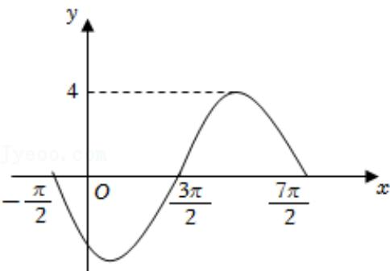

<!-- question-source:start -->
5.【单选题】已知函数 $y = A \sin (\omega x + \varphi) (A > 0, \omega > 0)$ 一个周期的图象如图所示，则该函数可以是（）

A. $y = 4\sin \left(\frac{l}{2} x + \frac{3\pi}{4}\right)$ 
B. $y = 4\sin \left(\frac{l}{2} x + \frac{5\pi}{4}\right)$ 
C. $y = 4\sin \left(2x + \frac{3\pi}{4}\right)$ 
D. $y = 4\sin \left(2x + \frac{5\pi}{4}\right)$
<!-- question-source:end -->

![[高中/课堂同步/智慧中小学/必修第一册/第五章 三角函数/5.4.3 正切函数的性质与图象/三角函数的图象与性质应用_2_/一_单选题/习题/answers/Q00051173A1.md]]
