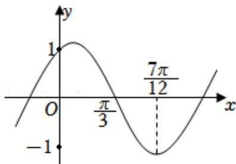

<!-- question-source:start -->
1.【单选题】记函数 $f(x)=\sin(\omega x+\varphi)$ （其中 $\omega>0,\quad|\varphi|<\frac{\pi}{2}$

）的图像为 $C$ ，已知 $C$ 的部分图像如图所示，为了得到函数 $g(x) = \sin \omega x$ ，只要把 $C$ 上所有的点（）

A. 向右平行移动 $\frac{\pi}{6}$ 个单位长度

B. 向左平行移动 $\frac{\pi}{6}$ 个单位长度

C. 向右平行移动 $\frac{\pi}{12}$ 个单位长度

D. 向左平行移动 $\frac{\pi}{12}$ 个单位长度
<!-- question-source:end -->

![[高中/课堂同步/智慧中小学/必修第一册/第五章 三角函数/5.4.3 正切函数的性质与图象/三角函数的图象与性质应用_2_/一_单选题/习题/answers/Q00051468A1.md]]
