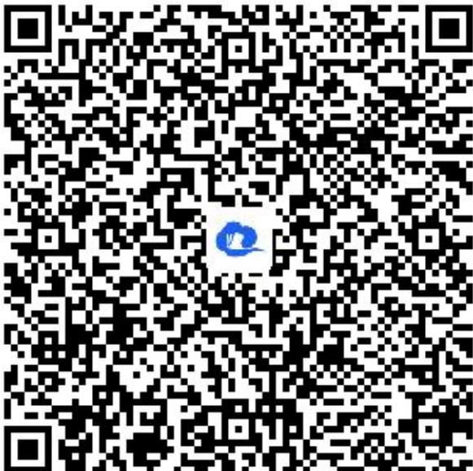

> [!faq]- 《正切函数的性质与图象》答案与解析
>
> > [!success]- **【答案】** $\left\{x|k\pi-\frac{\pi}{4}\leq x<k\pi+\frac{\pi}{2},\quad k\in Z\right\}$
>
> > [!note]- **【解析】**
> > 【更多习题信息】
> >
> > 难易度：偏难
> >
> > 知识点：正切函数的图象、正切函数的性质应用
> > 【智慧中小学APP扫码查看完整解析】
> >
> > 
