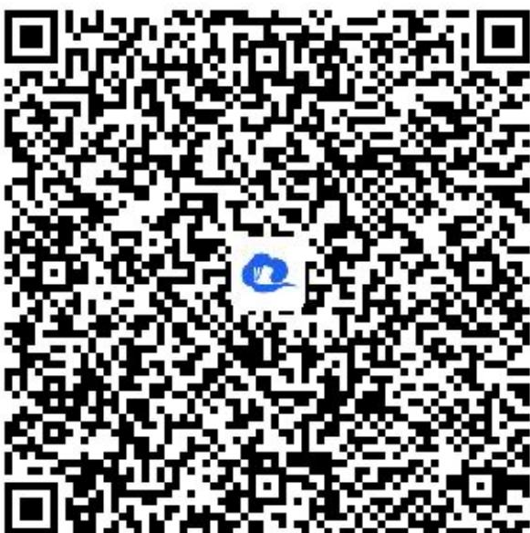

> [!faq]- 《简单的三角变换（1）》答案与解析
>
> > [!success]- **【答案】** 详见解析
>
> > [!note]- **【解析】**
> > 证明：若 $a$ 是第四象限角，则 $\sqrt{\frac{1 + \sin\alpha}{1 - \sin\alpha}} -\sqrt{\frac{1 - \sin\alpha}{1 + \sin\alpha}} = 2\tan \alpha$
> >
> > 【正确答案】证明： $\frac{1+\sin\alpha}{1-\sin\alpha}=\frac{(1+\sin\alpha)^{2}}{(1-\sin\alpha)(1+\sin\alpha)}=\frac{(1+\sin\alpha)^{2}}{1-(\sin\alpha)^{2}}=\frac{(1+\sin\alpha)^{2}}{1-\cos^{2}\alpha}$
> >
> > $$
> > \cos \alpha > 0
> > $$
> >
> > $$
> > \sin \alpha <   - 1
> > $$
> >
> > 所以 $1 + \sin \alpha > 0$ ，所以 $\sqrt{\frac{1 + \sin \alpha}{1 - \sin \alpha}} = \frac{1 + \sin \alpha}{\cos \alpha}$ ，同理 $\sqrt{\frac{1 - \sin \alpha}{1 + \sin \alpha}} = \frac{1 - \sin \alpha}{\cos \alpha}$ ，所以 $\sqrt{\frac{1 + \sin \alpha}{1 - \sin \alpha}} - \sqrt{\frac{1 - \sin \alpha}{1 + \sin \alpha}} = \frac{1 + \sin \alpha}{\cos \alpha}$ $-\frac{1 - \sin \alpha}{\cos \alpha} = 2\frac{\sin \alpha}{\cos \alpha} = 2\tan \alpha$
> >
> > 原式得证.
> >
> > 【更多习题信息】
> >
> > 难易度：偏难
> >
> > 知识点：同角三角函数的基本关系、三角恒等变换
> >
> > 【智慧中小学APP扫码查看完整解析】
> >
> > 
