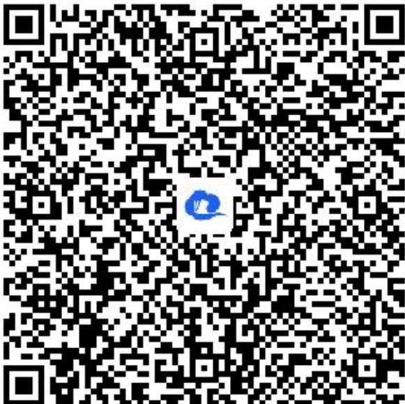

> [!faq]- 《简单的三角变换（2）》答案与解析
>
> > [!success]- **【答案】** 解：由已知得 $\tan\alpha=\frac{1}{2}$
>
> > [!note]- **【解析】**
> > (1) $\frac{\sin\alpha - 3\cos\alpha}{\sin\alpha + \cos\alpha} = \frac{\tan\alpha - 3}{\tan\alpha + 1} = -\frac{5}{3}$
> >
> > (2) $sin^2\alpha + \sin \alpha \cdot \cos \alpha + 2 = \sin^2\alpha + \sin \alpha \cdot \cos \alpha + 2(\cos^2\alpha + \sin^2\alpha) = \frac{3\sin^2\alpha + \sin \alpha \cdot \cos \alpha + 2\cos^2\alpha}{\cos^2\alpha + \sin^2\alpha} = \frac{3\tan^2\alpha + \tan \alpha + 2}{\tan^2\alpha + 1} = \frac{3 \times \frac{1}{4} + \frac{1}{2} + 2}{\frac{1}{4} + 1} = \frac{13}{5}$
> >
> > 【更多习题信息】
> >
> > 难易度：适中
> >
> > 知识点：同角三角函数的基本关系
> >
> > 【智慧中小学APP扫码查看完整解析】
> >
> > 
