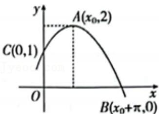

<!-- question-source:start -->
2.【单选题】已知函数 $f(x)=A\sin(\omega x+\varphi)\left(A>0,\quad\omega>0,\quad|\varphi|<\frac{\pi}{2}\right)$ 的部分图象如图所示，则函数 $f(x)$ 的解析式为（）

A. $f(x) = 2\sin \left(2x + \frac{\pi}{3}\right)$ 
B. $f(x) = 2\sin \left(2x + \frac{\pi}{6}\right)$ 
C. $f(x) = 2\sin \left(\frac{l}{2} x + \frac{\pi}{6}\right)$ 
D. $f(x) = 2\sin \left(\frac{l}{2} x + \frac{2\pi}{3}\right)$
<!-- question-source:end -->

![[高中/课堂同步/智慧中小学/必修第一册/第五章 三角函数/5.6 函数y=Asin(ωx+φ)/函数y_Asin_ωx_φ_的图象_1_/一_单选题/习题/answers/Q00051186A1.md]]
