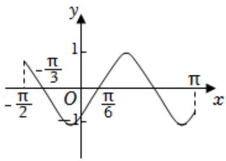
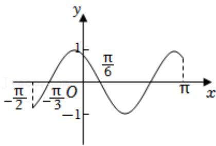
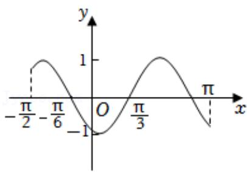
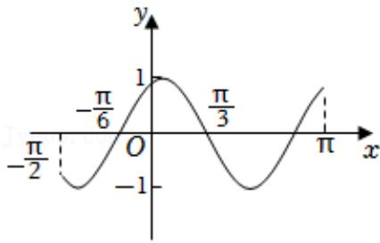

<!-- question-source:start -->
3.【单选题】函数 $y = \sin \left(2x + \frac{4\pi}{3}\right)$ 在区间 $\left[-\frac{\pi}{2}, \pi\right]$ 上的简图是（）

A. 

  
B. 

C. 

D.
<!-- question-source:end -->

![[高中/课堂同步/智慧中小学/必修第一册/第五章 三角函数/5.6 函数y=Asin(ωx+φ)/函数y_Asin_ωx_φ_的图象_1_/一_单选题/习题/answers/Q00051187A1.md]]
