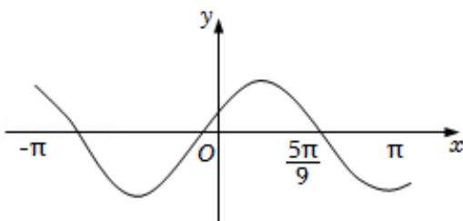

<!-- question-source:start -->
4.【单选题】设函数 $f(x)=\sin\left(\omega x+\frac{\pi}{6}\right)$ 在 $[-π,\pi]$ 的图象大致如图所示，则 $f(x)$ 的最小正周期为（）

A. $\frac{4\pi}{3}$ 
B. $\frac{3\pi}{2}$ 
C. $\frac{7\pi}{6}$

D. $\frac{10\pi}{9}$
<!-- question-source:end -->

![[高中/课堂同步/智慧中小学/必修第一册/第五章 三角函数/5.6 函数y=Asin(ωx+φ)/函数y_Asin_ωx_φ_的图象_1_/一_单选题/习题/answers/Q00051188A1.md]]
