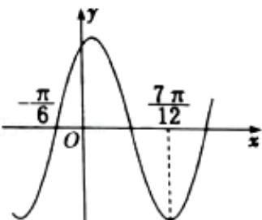

<!-- question-source:start -->
6.【单选题】已知函数 $f(x)=2\sin(\omega x+\varphi)\left(\omega>0,|\varphi|<\frac{\pi}{2}\right)$ 的部分图象大致如图所示，则下列说法错误的是（）

A. 函数 $f(x)$ 的最小正周期为 $\pi$ 
B. 函数 $f(x)$ 在 $\left[\frac{\pi}{3}, \frac{\pi}{2}\right]$ 上单调递减

C. $\left(-\frac{5\pi}{12},0\right)$ 是函数 $f(x)$ 图象的一个对称中心

D. 函数 $f(x)$ 的图象可以由函数 $y = 2\cos \left( x - \frac{\pi}{6} \right)$ 图象上各点的纵坐标不变，横坐标缩小为原来的 $\frac{1}{2}$ 得到
<!-- question-source:end -->

![[高中/课堂同步/智慧中小学/必修第一册/第五章 三角函数/5.6 函数y=Asin(ωx+φ)/函数y_Asin_ωx_φ_的图象_1_/一_单选题/习题/answers/Q00051190A1.md]]
