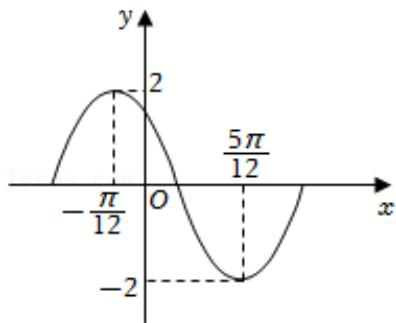

<!-- question-source:start -->
1.【单选题】已知函数 $f(x)=A\sin(\omega x+\varphi)(A>0,\ \omega>0,\ |\varphi|<\pi)$

的部分图象如图所示，将该函数的图象沿x轴向右平移 $\frac{\pi}{4}$ 个单位长度后得到函数 $g(x)$ 的图象，则下列区间中， $g(x)$ 单调递增的区间是（）

A. $\left(\frac{\pi}{2},\quad\frac{2\pi}{3}\right)$

B. $\left(\frac{\pi}{3},\quad\frac{\pi}{2}\right)$

$$
\left( \begin{array}{c c} 0, & \frac {\pi}{6} \end{array} \right)
$$

$$
\left( \begin{array}{c c} \pi & \pi \\ \hline 6 & 3 \end{array} \right)
$$
<!-- question-source:end -->

![[高中/课堂同步/智慧中小学/必修第一册/第五章 三角函数/5.6 函数y=Asin(ωx+φ)/函数y_Asin_ωx_φ_的图象_1_/一_单选题/习题/answers/Q00051501A1.md]]
