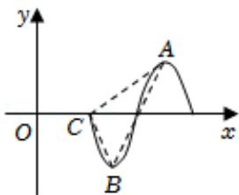

<!-- question-source:start -->
2.【单选题】已知函数 $f(x)=\sin(\pi x+\varphi)$ 在某个周期的图象如图所示，A，B分别是 $f(x)$ 图象的最高点与最低点，C是 $f(x)$ 图象与x轴的交点，则 $\tan\angle ACB=$ （）

A. -8  
B. $-\frac{7\sqrt{65}}{65}$ 
C. $-\frac{4}{7}$ 
D. $-\frac{\sqrt{65}}{65}$
<!-- question-source:end -->

![[高中/课堂同步/智慧中小学/必修第一册/第五章 三角函数/5.6 函数y=Asin(ωx+φ)/函数y_Asin_ωx_φ_的图象_2_/一_单选题/习题/answers/Q00051191A1.md]]
