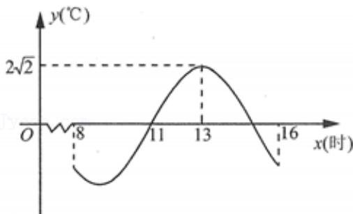

<!-- question-source:start -->
1.【单选题】2022年春节期间，G市某天从8-16时的温度变化曲线（如图）近似满足函数 $f(x)=2\sqrt{2}\cos(\omega x+\varphi)(\omega>0,\quad0<\varphi<\pi,\quad x\in[8,16])$ 的图象．下列说法正确的是（）

A. 8 - 13时这段时间温度逐渐升高  
B. 8 - 16时最大温差不超过 $5^{\circ} \mathrm{C}$ 
C. 8 - 16时 $0^{\circ} \mathrm{C}$ 以下的时长恰为3小时

D. 16 时温度为 $-2^{\circ} \mathrm{C}$
<!-- question-source:end -->

![[高中/课堂同步/智慧中小学/必修第一册/第五章 三角函数/5.6 函数y=Asin(ωx+φ)/函数y_Asin_ωx_φ_的图象_2_/一_单选题/习题/answers/Q00051497A1.md]]
