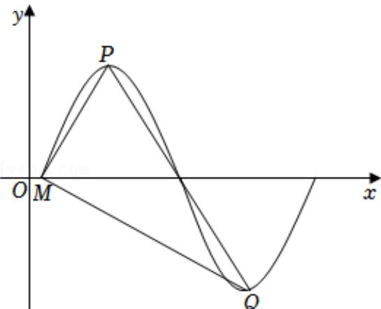

<!-- question-source:start -->
4.【填空题】已知函数 $f(x)=\sqrt{3}\sin(\omega x+\varphi)\left(\omega>0,\quad|\varphi|<\frac{\pi}{2}\right)$

在一个周期内的图象如图所示，其中点P，Q分别是图象的最高点和最低点，点M是图象与x轴的交点，且 $MP \perp MQ$ 。若 $f\left(\frac{1}{2}\right)=\frac{\sqrt{3}}{2}$ ，则 $\tan\varphi=$ \_\_\_\_.

<!-- question-source:end -->

![[高中/课堂同步/智慧中小学/必修第一册/第五章 三角函数/5.6 函数y=Asin(ωx+φ)/函数y_Asin_ωx_φ_的图象_2_/二_填空题/习题/answers/Q00051498A1.md]]
