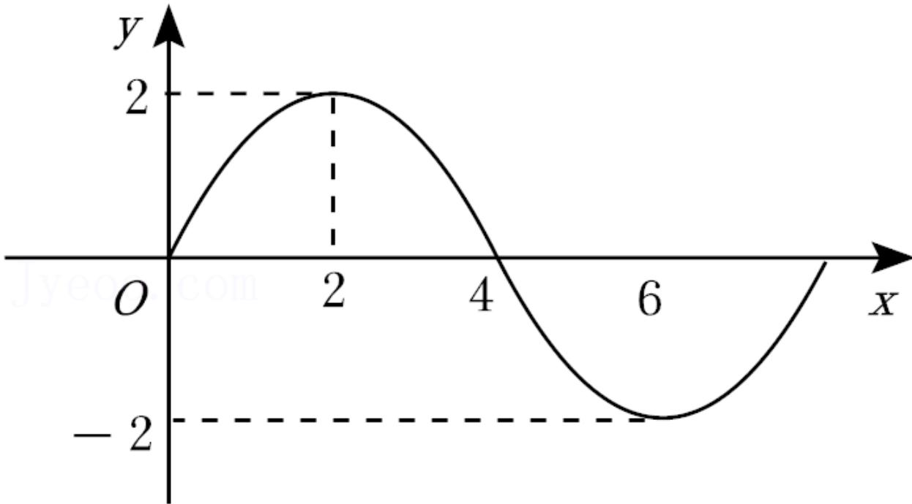

<!-- question-source:start -->
5.【填空题】函数 $f(x)=A\cos(\omega x+\varphi)(A>0,\ \omega>0)$ 的部分图象如图所示，则 $f
(1)+f
(2)+f
(3)+\cdots+f_{(2020)}+f_{(2021)}=$ \_\_\_\_.

<!-- question-source:end -->

![[高中/课堂同步/智慧中小学/必修第一册/第五章 三角函数/5.6 函数y=Asin(ωx+φ)/函数y_Asin_ωx_φ_的图象_2_/二_填空题/习题/answers/Q00051499A1.md]]
