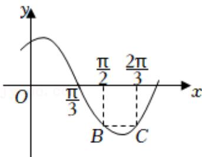

<!-- question-source:start -->
6.【填空题】函数 $f(x)=\sin(\omega x+\varphi)\left(\omega>0,|\varphi|<\frac{\pi}{2}\right)$ 的部分图像如图所示， $BC//x$ 轴，则 $\omega=$ \_\_\_\_， $\Phi=$ \_\_\_\_.

<!-- question-source:end -->

![[高中/课堂同步/智慧中小学/必修第一册/第五章 三角函数/5.6 函数y=Asin(ωx+φ)/函数y_Asin_ωx_φ_的图象_2_/二_填空题/习题/answers/Q00051500A1.md]]
