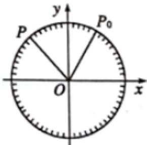

<!-- question-source:start -->
2.【单选题】为了研究钟表秒针针尖的运动变化规律，建立如图所示的平面直角坐标系，设秒针针尖位置为点 $P(x, y)$ ，若初始位置为点 $P_{0}\left(\frac{1}{2}, \frac{\sqrt{3}}{2}\right)$ ，秒针从 $P_{0}$ （规定此时t=0）开始沿顺时针方向转动，点P的纵坐标y与时间t的函数关系式可能为（）

A. $y = 2\sin \left(-\frac{\pi}{30} t + \frac{\pi}{3}\right)$

B. $y = -sin\left(-\frac{\pi}{60}t - \frac{\pi}{3}\right)$

C. $y = \sin \left(-\frac{\pi}{30} t + \frac{\pi}{6}\right)$

D. $y = \cos \left(\frac{\pi}{30} t + \frac{\pi}{6}\right)$
<!-- question-source:end -->

![[高中/课堂同步/智慧中小学/必修第一册/第五章 三角函数/5.7 三角函数的应用/三角函数的应用_2_/一_单选题/习题/answers/Q00051197A1.md]]
