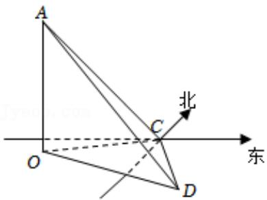

<!-- question-source:start -->
3.【填空题】如图所示，OA是一座垂直于地面的信号塔，O点在地面上，某人（身高不计）在地面的C点处测得信号塔顶A在南偏西70°方向，仰角为45°，他沿南偏东50°方向前进20m到点D处，测得塔顶A的仰角为30°，则塔高OA为 \_\_\_\_ m。

<!-- question-source:end -->

![[高中/课堂同步/智慧中小学/必修第一册/第五章 三角函数/5.7 三角函数的应用/三角函数的应用_2_/二_填空题/习题/answers/Q00051508A1.md]]
