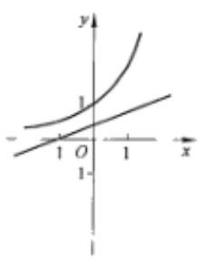
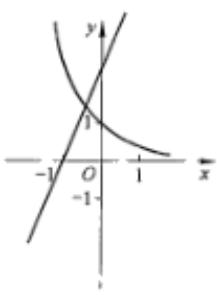
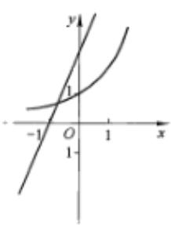
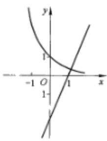

<!-- question-source:start -->
5.【单选题】函数 $y = a^{x}$ 和 $y = a(x + 1)$ （其中 $a > 1$ 且 $a \neq 1$ ）的大致图象只可能是（）

A. 

B. 

C. 

D.
<!-- question-source:end -->

![[高中/课堂同步/智慧中小学/必修第一册/第四章 指数函数与对数函数/4.2 指数函数/指数函数的图象和性质/一_单选题/习题/answers/Q00051201A1.md]]
