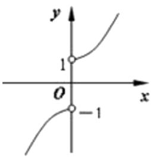
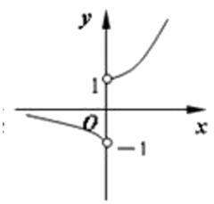
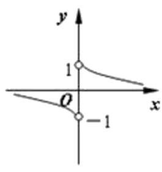
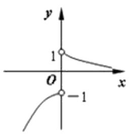

<!-- question-source:start -->
8.【单选题】函数 $y = \frac{x}{|x|} a^x (0 < a < 1)$ 的图像的大致形状是（）

A. 

  
B. 

  
C. 

D.
<!-- question-source:end -->

![[高中/课堂同步/智慧中小学/必修第一册/第四章 指数函数与对数函数/4.2 指数函数/指数函数的图象和性质/一_单选题/习题/answers/Q00051204A1.md]]
