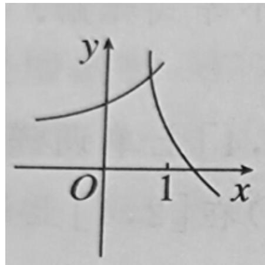
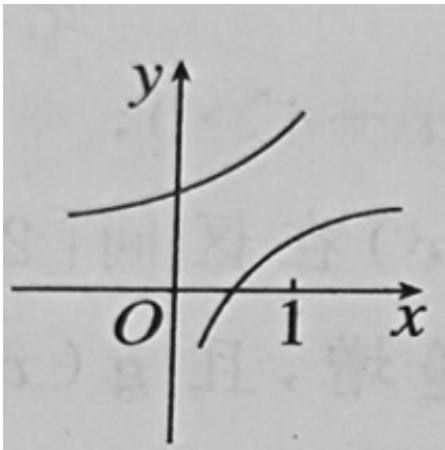
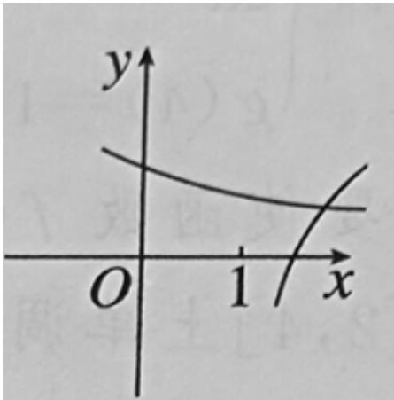
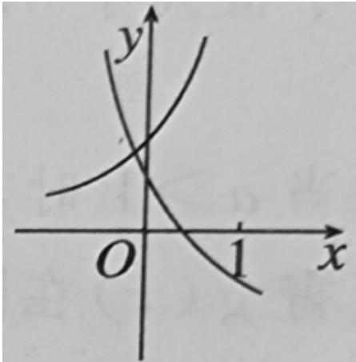

<!-- question-source:start -->
4.【单选题】在同一直角坐标系中，函数 $y=\frac{1}{a^{x}}$ ， $y=\log_{a}\left(x+\frac{1}{2}\right)(a>0$ 且 $a\neq1)$ 的图象可能是（）

A. 

B. 

  
C. 

D.
<!-- question-source:end -->

![[高中/课堂同步/智慧中小学/必修第一册/第四章 指数函数与对数函数/4.4.2 对数函数的图象和性质/一_单选题/习题/answers/Q00051220A1.md]]
