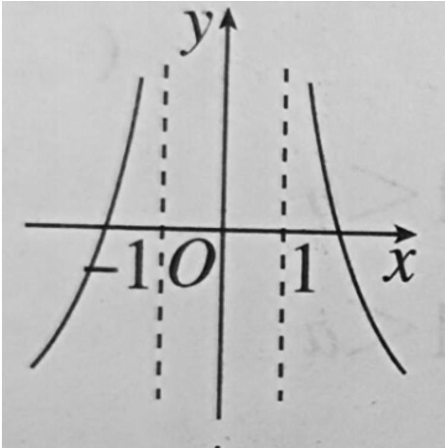
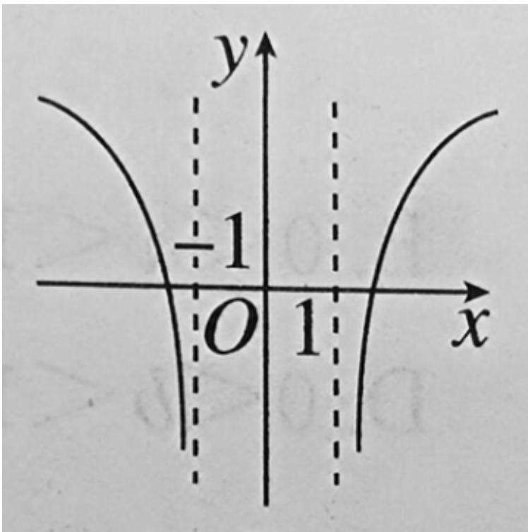
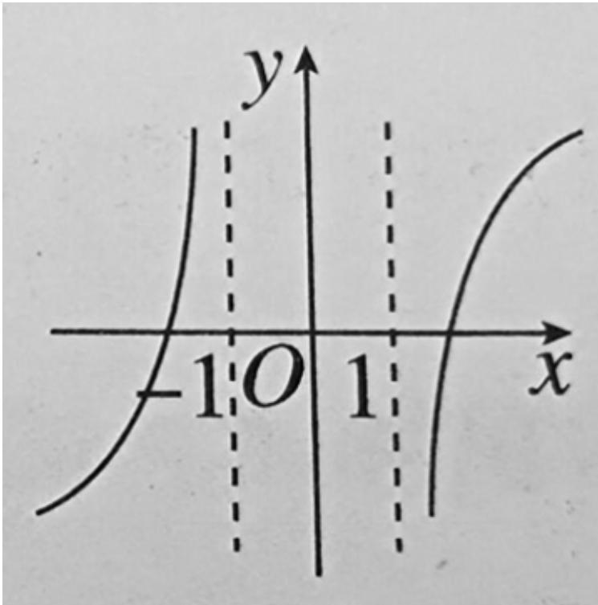
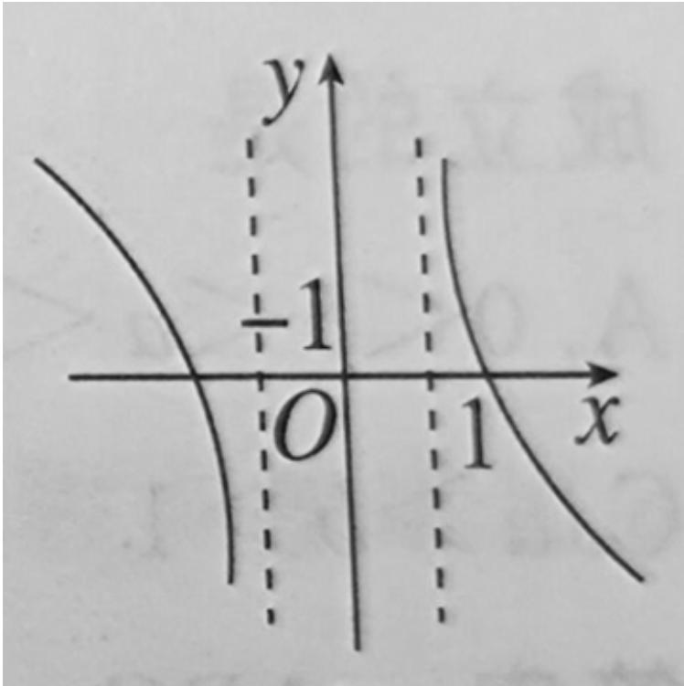

<!-- question-source:start -->
5.【单选题】函数 $f(x) = \lg (|x| - 1)$ 的大致图象是（）

  
A. 

  
B. 

D.
<!-- question-source:end -->

![[高中/课堂同步/智慧中小学/必修第一册/第四章 指数函数与对数函数/4.4.2 对数函数的图象和性质/一_单选题/习题/answers/Q00051221A1.md]]
