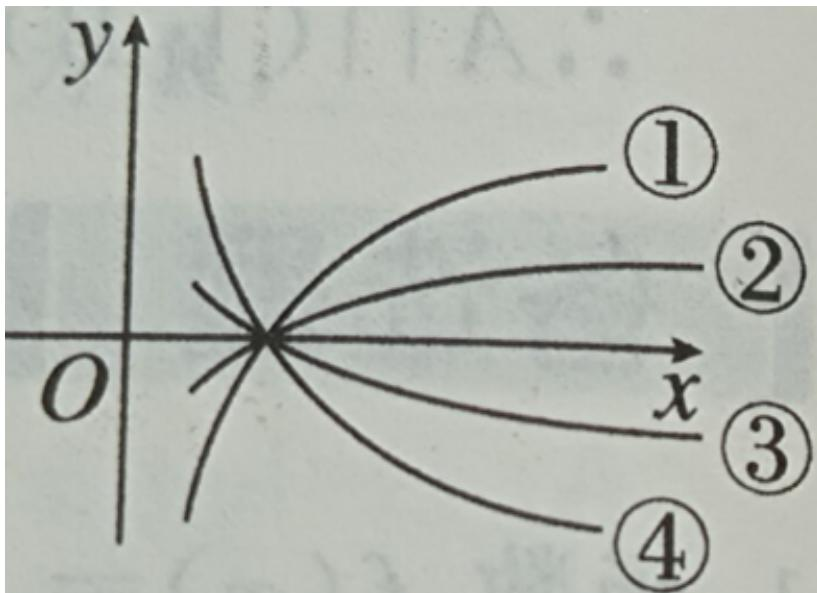

<!-- question-source:start -->
10.【单选题】函数 $\mathbb{I}y = \log_{a}x, \mathbb{I}y = \log_{b}x, \mathbb{I}y = \log_{c}x, \mathbb{I}y = \log_{d}x$ 的图象如下图所示，则 a, b, c, d 的大小顺序是（）

A. $1 < d < c < a < b$

B. $c < d < 1 < a < b$

C. $c < d < 1 < b < a$

D. $d < c < 1 < a < b$
<!-- question-source:end -->

![[高中/课堂同步/智慧中小学/必修第一册/第四章 指数函数与对数函数/4.4.2 对数函数的图象和性质/一_单选题/习题/answers/Q00051226A1.md]]
