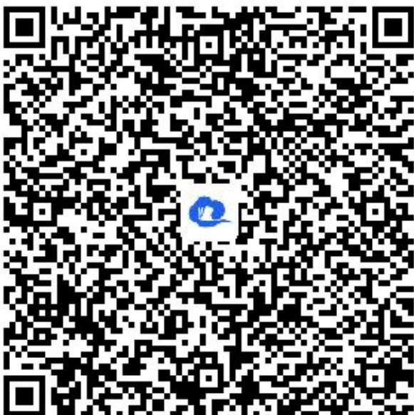

> [!faq]- 《对数函数的图象和性质》答案与解析
>
> > [!success]- **【答案】** $\left[\left(\frac{l}{2}\right)^{\frac{\sqrt{2}}{2}}, l\right)$
>
> > [!note]- **【解析】**
> > 【更多习题信息】
> >
> > 难易度：偏难
> >
> > 知识点：对数函数的性质、指数函数的性质、分类讨论思想
> >
> > 【智慧中小学APP扫码查看完整解析】
> >
> > 
