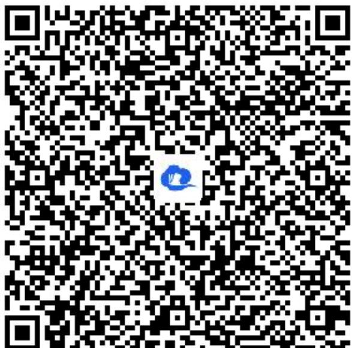

> [!faq]- 《对数函数的图象和性质》答案与解析
>
> > [!success]- **【答案】** 详见解析
>
> > [!note]- **【解析】**
> > 【提示】
> >
> > (1)【问答题】解析视频请查看最后一题。
> >
> > 【更多习题信息】
> >
> > 难易度：偏难
> >
> > 知识点：对数函数的性质、函数的奇偶性、复合函数的单调性
> >
> > 【智慧中小学APP扫码查看完整解析】
> >
> > 
