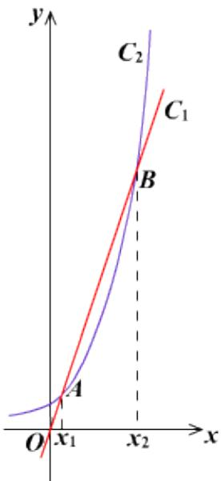

<!-- question-source:start -->
2.【复合题】. 函数 $f(x) = 2^x$ 和 $g(x) = x^3$ 的图象如图所示．设两函数的图象交于点 $A(x_1, y_1)$ ， $B(x_2, y_2)$ ，且 $x_1 < x_2$ .

(1)【问答题】请指出示意图中曲线 $C_{1}$ ， $C_{2}$ 分别对应哪一个函数；

(2)【问答题】结合函数图象示意图，判断 $f_{
(6)}$ ， $g_{ (6)}$ ， $f_{(2019)}$ ， $g_{(2019)}$ 的大小.
<!-- question-source:end -->

![[高中/课堂同步/智慧中小学/必修第一册/第四章 指数函数与对数函数/4.4.3 不同函数增长的差异/二_复合题/习题/answers/Q00051548A1.md]]
