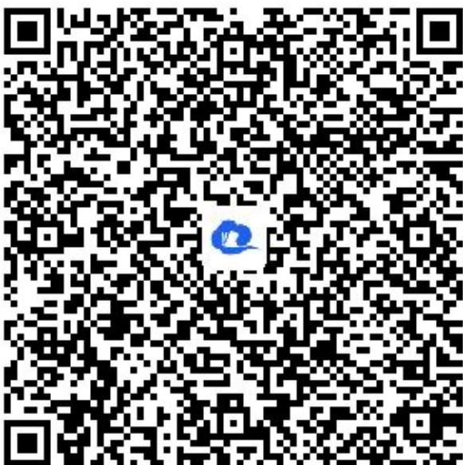

> [!faq]- 《函数的零点与方程的解》答案与解析
>
> > [!success]- **【答案】** (1)
>
> > [!note]- **【解析】**
> > $$
> > \therefore \log_ {3} (3 ^ {- x} + 1) - \frac {1}{2} k x = \log_ {3} (3 ^ {x} + 1) + \frac {1}{2} k x
> > $$
> >
> > 化简得 $\log_3\left(\frac{3^x + 1}{3^x + 1}\right) = kx$ ，即 $\log_3\frac{1}{3^x} = kx$ ， $\log_33^{-x} = kx$ ， $\therefore -x = kx$ ，即 $(k + 1)x = 0$ 对任意的 $x \in R$ 都成立， $\therefore k = -1$ ；
> >
> > (2)【问答题】由题意知，方程 $\log_3(3^x + 1) - \frac{1}{2} x = \frac{1}{2} x + a$ 有解，
> >
> > 亦即 $\log_3(3^x + 1) - x = a$ ，即 $\log_3\left(\frac{3^x + 1}{3^x}\right) = a$ 有解， $\therefore \log_3(1 + \frac{1}{3^x}) = a$ 有解，
> >
> > 由 $\frac{1}{3^x} > 0$ ，得 $1 + \frac{1}{3^x} > 1$ ， $\log_3\left(1 + \frac{1}{3^x}\right) > 0$ ，故 $a > 0$ ，即 $a$ 的取值范围是 $(0, +\infty)$ 。
> >
> > (1)【问答题】解析视频请查看最后一题。
> >
> > 【更多习题信息】
> >
> > 难易度：适中
> >
> > 知识点：指数运算、函数的性质、函数综合
> >
> > 【智慧中小学APP扫码查看完整解析】
> >
> > 
