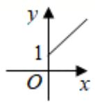
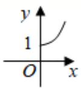
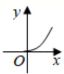
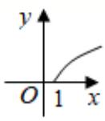

<!-- question-source:start -->
1.【单选题】某林区的森林蓄积量每年比上一年平均增长 $10.4\%$ ，要增长到原来的 $x$ 倍，需经过 $y$ 年，则函数 $y = f(x)$ 的图象大致为（）

A. 

B. 

C. 

D. 

<!-- question-source:end -->

![[高中/课堂同步/智慧中小学/必修第一册/第四章 指数函数与对数函数/4.5.3 函数模型的应用/函数模型的应用_1_/一_单选题/习题/answers/Q00051572A1.md]]
