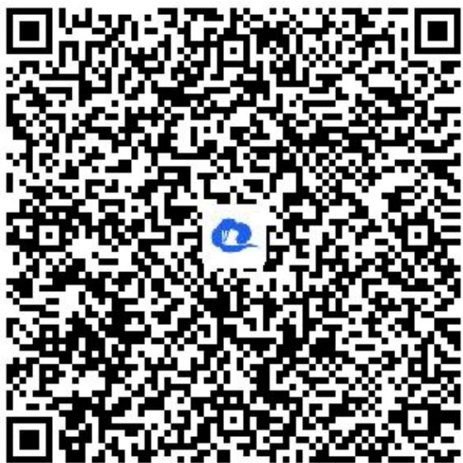

> [!faq]- 《7.3.1复数的三角表示式》答案与解析
>
> > [!success]- **【答案】** $\sqrt{2}\left(\cos\frac{3\pi}{4}+\mathrm{i}\sin\frac{3\pi}{4}\right)$ ， $\frac{3\pi}{4}$
>
> > [!note]- **【解析】**
> > 【更多习题信息】
> >
> > 难易度：适中
> >
> > 知识点：复数的四则运算，三角表示和辐角的概念
> >
> > 【智慧中小学APP扫码查看完整解析】
> >
> > 
